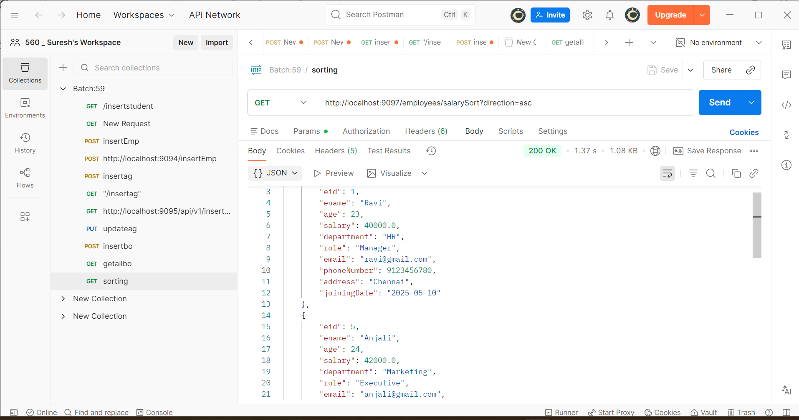
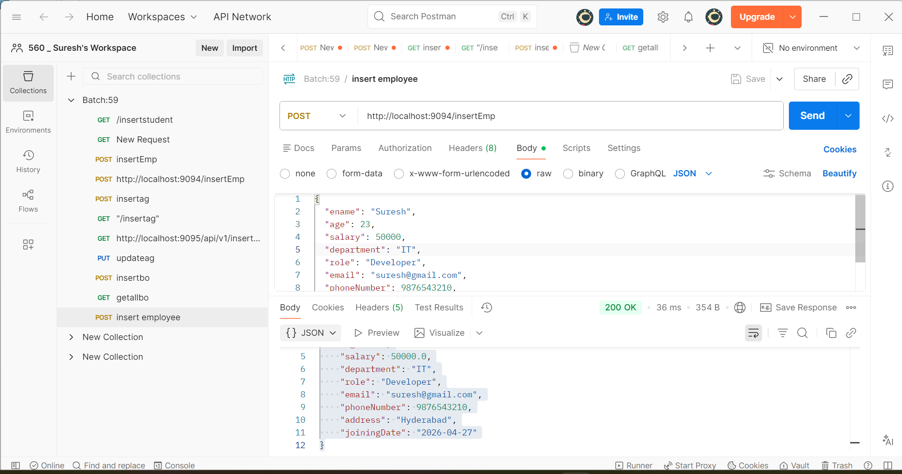
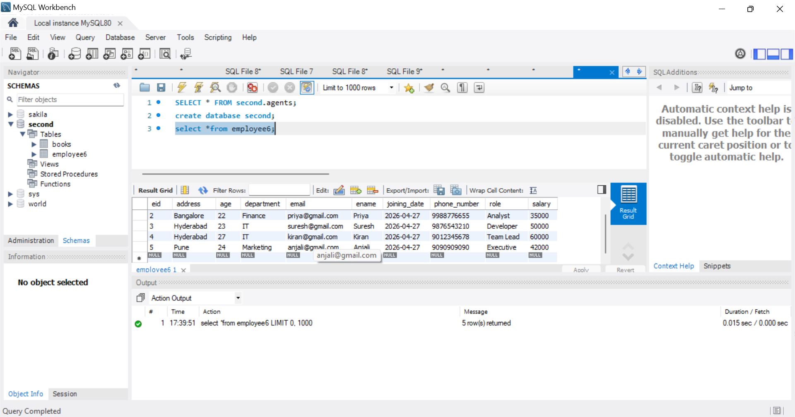
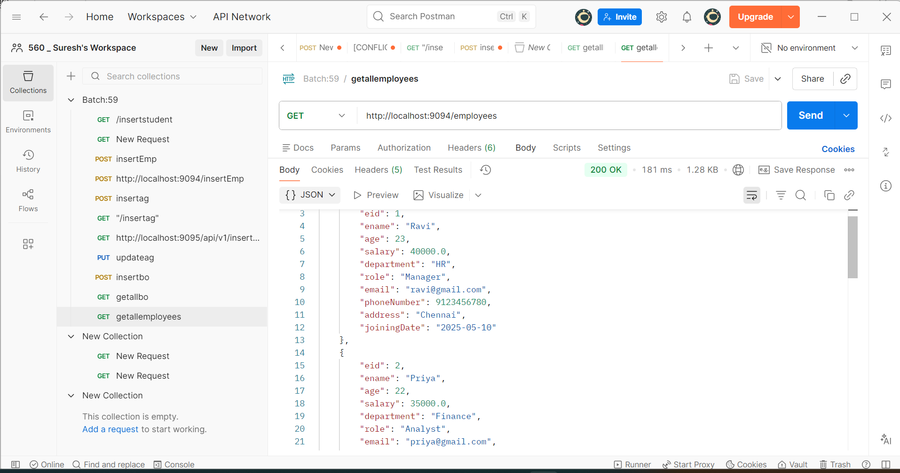

# 🚀 Employee Management System (Spring Boot)

##  Project Overview

I developed this REST API-based Employee Management System using Spring Boot to manage employee data efficiently.
It supports CRUD operations along with Pagination, Sorting, and Validation.
This project demonstrates my understanding of backend development, REST APIs, and database integration.
The application is connected with MySQL database.

---

##  Features

### 🔹 CRUD Operations

* Add Employee
* Get All Employees
* Get Employee By ID
* Update Employee
* Delete Employee

### 🔹 Pagination

* Fetch employees page-wise
  Example:
  GET /employees/page?page=0&size=2

### 🔹 Sorting

* Sort employees based on salary (ASC / DESC)
  Example:
  GET /employees/salarySort?direction=asc

### 🔹 Validation

* Name should not be empty
* Email should be valid
* Salary must be positive

---

##  Tech Stack

* Java
* Spring Boot
* Spring Data JPA
* MySQL
* REST API
* Maven

---

##  API Endpoints

POST   /insertEmp
GET    /employees
GET    /employees/{id}
PUT    /employees/{id}
DELETE /employees/{id}
GET    /employees/page
GET    /employees/salarySort

---

## 🧪 Sample JSON

{
"ename": "Ravi",
"age": 23,
"salary": 40000,
"department": "HR",
"role": "Manager",
"email": "[ravi@gmail.com](mailto:ravi@gmail.com)",
"phoneNumber": 9123456780,
"address": "Chennai",
"joiningDate": "2025-05-10"
}

---

## ⚙️ How to Run

1. Clone repository
   git clone https://github.com/kanakamedalasuresh1-pixel/employee-management-system.git

2. Open in IDE

3. Configure MySQL in application.properties

4. Run Spring Boot application

---

##  Key Highlights

* REST API project
* Pagination & Sorting implemented
* Validation added
* MySQL integration

---

Suresh
Aspiring Java Developer 
